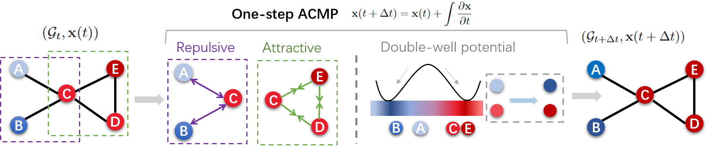

# ACMP: Allen-Cahn Message Passing with Attractive and Repulsive Forces for Graph Neural Networks

Our paper is at https://openreview.net/forum?id=4fZc_79Lrqs

## Introduction

 Neural message passing is a basic feature extraction unit for graph-structured data considering neighboring node features in network propagation from one layer to the next. We model such process by an interacting particle system with attractive and repulsive forces and the Allen-Cahn force arising in the modeling of phase transition. The dynamics of the system is a reaction-diffusion process which can separate particles without blowing up. This induces an Allen-Cahn message passing (ACMP) for graph neural networks where the numerical iteration for the particle system solution constitutes the message passing propagation. ACMP which has a simple implementation with a neural ODE solver can propel the network depth up to one hundred of layers with theoretically proven strictly positive lower bound of the Dirichlet energy. It thus provides a deep model of GNNs circumventing the common GNN problem of oversmoothing. GNNs with ACMP achieve state of the art performance for real-world node classification tasks on both homophilic and heterophilic datasets.


## Requirements

To install requirements:

```
pip install -r requirements.txt
```

or 

```
conda env create -f environment.yml
```


## Citation 
If you consider our codes and datasets useful, please cite:
```
@inproceedings{
wang2023acmp,
title={{ACMP}: Allen-Cahn Message Passing with Attractive and Repulsive Forces for Graph Neural Networks},
author={Yuelin Wang and Kai Yi and Xinliang Liu and Yu Guang Wang and Shi Jin},
booktitle={The Eleventh International Conference on Learning Representations },
year={2023},
url={https://openreview.net/forum?id=4fZc_79Lrqs}
}
```
